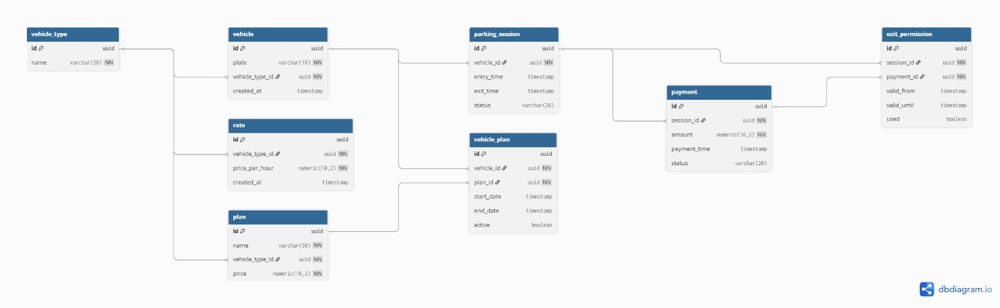

# 🚗 AutoPark

AutoPark is a **parking management system** that allows registering vehicle entries and exits, managing parking subscriptions, and processing online payments through Mercado Pago.

The project is structured as a **monorepo** with a Node.js REST API backend and a static frontend built with HTML and TailwindCSS.

---

## 📚 Table of Contents

* Description
* Architecture
* Technologies
* Requirements
* Installation
* Environment Variables
* Scripts
* API Endpoints
* Payment Integration
* Frontend
* System Flow
* Project Structure
* Roadmap
* Authors

---

## 📌 Description

AutoPark provides core parking-lot management features such as:

* Vehicle entry registration
* Vehicle exit processing and fee calculation
* Parking subscription management
* Hourly rate consultation
* Online payment processing via Mercado Pago

The system relies on **PostgreSQL stored procedures** to handle the main parking operations.

---

## 🏗 Architecture

```
Frontend (HTML + Tailwind)
        ↓
REST API (Express)
        ↓
Controllers
        ↓
Services
        ↓
Repositories
        ↓
PostgreSQL (Stored Procedures)
        ↓
Mercado Pago
```

---
# Entity Relationship Diagram (ERD)



---

## 🧰 Technologies

### Backend

* Node.js
* Express
* PostgreSQL
* Mercado Pago SDK

### Frontend

* HTML
* TailwindCSS (CDN)
* Modular JavaScript
* AOS (Animate On Scroll)

### Tools

* npm
* dotenv

---

## ⚙ Requirements

* Node.js **18+**
* PostgreSQL **14+**
* npm **9+**
* Mercado Pago account

---

## 📦 Installation

1️⃣ Clone the repository

git clone https://github.com/Riwi-io-Medellin/berlin-integrative-project-tesla.git

2️⃣ Navigate into the project

cd autopark

3️⃣ Install dependencies

npm install

4️⃣ Create environment file

Copy:

.env.template

into:

.env

and fill in the required variables.

5️⃣ Start the backend server

npm start

6️⃣ Serve the frontend

npx serve frontend/public

or use any static file server.

---

## 💳 Payment Integration

The system integrates **Mercado Pago** for online payments.

Flow:

1. The system calculates the amount using `/vehicle/exit`
2. A payment preference is created
3. The API returns the `initPoint` payment URL
4. The frontend redirects the user to Mercado Pago checkout

Main integration file:

backend/src/sdk/mercadopago.js

---

## 🖥 Frontend

### Landing Page

frontend/public/index.html

### Main Pages

frontend/src/pages/

* suscriptions.html
* vehicleExit.html

### Scripts

frontend/src/scripts/

* viewuser
* api
* doom.js

---

## 🔄 System Flow

### Vehicle Entry
```
POST /vehicle/register
        ↓
Stored Procedure: enter_parking
        ↓
Vehicle registered in database
```

---

### Vehicle Exit
```
POST /vehicle/exit
        ↓
Stored Procedure: process_vehicle_exit
        ↓
Fee calculated
```

---

### Online Payment
```
POST /vehicle/payment
        ↓
Mercado Pago preference created
        ↓
User redirected to checkout
```

---

## 📂 Project Structure

```
.
│   .env.template
│   .gitignore
│   image.png
│   package-lock.json
│   package.json
│   README.fulls.md
│   README.md
│
├── backend
│   │   server.js
│   │
│   └── src
│       │   app.js
│       │
│       ├── config
│       │       database.js
│       │       env.js
│       │
│       ├── controllers
│       │       vehicle.controller.js
│       │
│       ├── repositories
│       │       vehicle.repository.js
│       │
│       ├── routes
│       │       vehicle.routes.js
│       │
│       ├── sdk
│       │       mercadopago.js
│       │
│       └── services
│               payment.service.js
│               vehicle.service.js
│
└── frontend
    ├── public
    │       index.html
    │
    └── src
        ├── assets
        │       favicon.jpg
        │       hero.jpg
        │       logo-icon.png
        │
        ├── components
        ├── pages
        │   │   suscriptions.html
        │   │   vehicleExit.html
        │   │
        │   └── admin
        │           dashboard.html
        │           hourlyParking.html
        │           suscriptions.html
        │
        ├── scripts
        │   │   doom.js
        │   │   main.js
        │   │
        │   ├── api
        │   │       suscriptions.api.js
        │   │       vehicle.api.js
        │   │
        │   ├── viewadmin
        │   │       dashboard.admin.js
        │   │
        │   └── viewuser
        │           suscription.user.js
        │           vehicleExit.js
        │
        └── styles
```
## 🧭 Roadmap

* Automatic **license plate recognition**
* Full admin dashboard
* Payment history module
* Parking occupancy analytics
* Automated tests

---

## 👨‍💻 Authors

* Santiago Botero Diaz
* Steven Alexander Patiño Arenas
* Robinson Urrego
* Samuel Aristizabal Rueda

---
